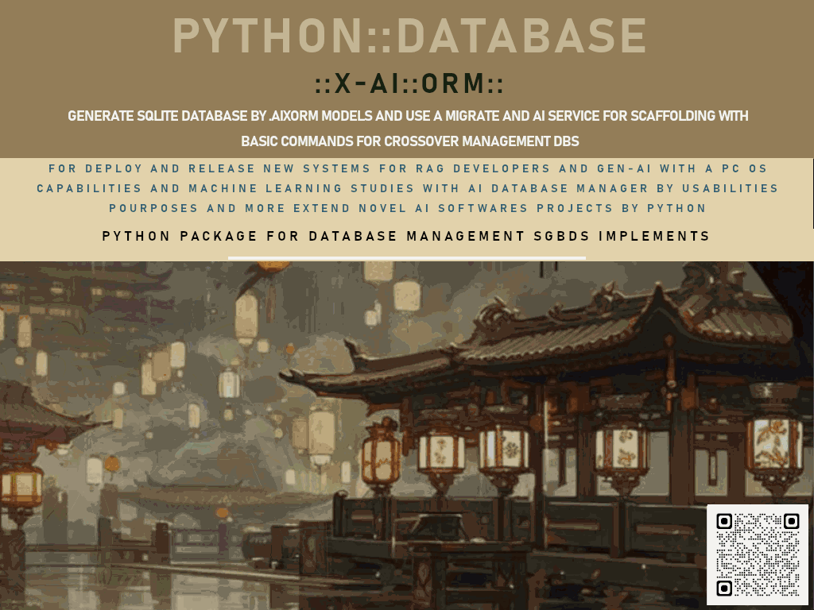

## 🧠 Python Database X-AI ORM
# PY_DBXIA_ORM  
### Python Database X-AI ORM  

[](https://github.com/ssmool/PY_DBXIA_ORM)  
[](https://pypi.org/project/database-xaiorm/)  



**Version:** 2.0 Beta  
**Status:** Under Development  
**Author:** #asytrick  
**Website:** [github.com/PY_DBXIA_ORM](https://github.com/ssmool/PY_DBXIA_ORM)  
**Contact:** eusmool@gmail.com  

##📌 Overview

**Python Database X-AI ORM** is an object-relational mapping (ORM) tool for SQLite focused on simplicity, productivity, and AI integration.  
This project aims to accelerate relational database development with:

- ER model installation via dictionary-based files.
- One-command execution for common database operations.
- Compatible model generation with the help of OpenAI prompts.
- Support for model evolution and AI-assisted updates.

##🚀 Features

- Lightweight ORM for SQLite.
- Table creation via JSON/Python dictionary files.
- Simplified one-liner commands for CRUD operations.
- Model generation assistance using OpenAI prompts.
- Designed for future extensibility with multiple database backends.

---

## 📌 About the Project  

**PY_DBXIA_ORM** is a Python project that introduces a new approach to **ORM (Object Relational Mapping)** by integrating **X-AI (Crossover AI)** features for relational databases.  

It combines **multi-database support**, automatic model generation, and **ANSI SQL query execution** with advanced data analysis, cryptography, and data manipulation tools.  

An innovative research project created by **#asytrick**.  

---

## 🚀 Features  

- ✅ **Crossover ORM** for SQLite (expanding support for ODBC, MySQL, PostgreSQL, and soon SQL Server).  
- ✅ **ANSI SQL query execution** directly via ORM.  
- ✅ **Analytics** with Pandas for data visualization and charts.  
- ✅ **BLOB data handling** to insert files into SQLite.  
- ✅ **Cryptography support** with **RSA** and **Fernet**.  
- ✅ **Scaffolding** from `.pyaiporm` model files.  
- ✅ **GTK GUI prototype** for visual database management.  
- ✅ **Logging system** with HTML export.  
- ✅ **X-AI ORM** for ER model generation (`.pyaiporm`) from text prompts.  
- ✅ **ORM Migrate** with data import from **CSV, ODBC, MySQL, PostgreSQL** (SQL Server coming soon).  
- ✅ External data visualization and integration.  

---

##🔮 Roadmap

✅ Version 2.0 Beta
- ✅ Basic ORM for SQLite.
- ✅ Dictionary-based schema installation.
- ✅ Simplified one-command operations.
- ✅ AI-assisted model generation support.

##🔜 In Progress
- ✅ **Pandas** integration for data analysis and exports.
- ✅ **Scikit-learn** integration for machine learning based on online data.
- ✅ **HTML historical logs** and file-based records.
- ✅ **Automatic encryption** for sensitive fields.
- ✅ Full support for **BLOB** fields (images, files, etc.).

##🌐 Version 2.0 (Planned)
- ✅ Lightweight built-in database engine.
- ✅ Multi-database support via **ODBC**.
- ✅ Compatibility with modern RDBMS (PostgreSQL, MySQL, etc.).
- ✅ GUI for visualizing schemas and data.

## 🛠 Install:

The project is avaliable on the **PyPI**:  

```bash
#pip install database_xaiorm==8.0 #comming soon with a review for deploy
```

📂 Estrutura do Projeto

    ./manual/README.md → Manual de uso e documentação.

    orm/ → Módulos principais de ORM.

    analytics/ → Funções de análise e gráficos com Pandas.

    crypto/ → Implementações de segurança e criptografia.

    db/ / → .sqlite database files

    orm_migrate/ → Migração e importação de dados.

    gui_enterprise/ → Protótipo em GTK GUI para manipulação visual.

    logs/ → Gerenciamento de logs com exportação HTML.

    blob_data/ / → Generate and Get Encoding for BLOB FILES to fill fields files register

    dict/  → fill models to scaffolding .pyiaorm models orm

    html_log/ → viewer logs and models with html views

    orm_ai/ → prompt ai for generate models orm for .pyaiorm with basic rules


📊  Roadmap (Próximas Versões)

    🔹 Add supports with OpenAI for models generate by prompt

    🔹 Allows speech voice commands

    🔹 Task Schuedler for launch works automated with calendar

    🔹 Policy and Criptografy automatic with RSA and Fernet

    🔹 Add password for granted connection

    🔹 API for on-line app connect and telnet service for management

    🔹 Release forms and others with scaffolding with models /dict for web and app(crossover) with Kivy

🌟 Noveu:

The PY_DBXIA_ORM like a noveu gen by ORMs thats union:

    💡 Artificial Inteligencies

    🔐 Advanced Securtiy

    📊 Data Viewer and Analytics 

    🔌 RDBMS Database Connection Avaliable


**Requirements:**
- Python 3.8+
- SQLite (included by default with Python)
- Additional dependencies to be listed as the project evolves.

Manual:

Check the complete manual for manage the ORM Library for Python: 

##📫 Contact

💻 Autor: #asytrick
📧 Contact: eusmool@gmail.com
- Repository: [github.com/PY_DBXIA_ORM](https://github.com/ssmool/PY_DBXIA_ORM)  
