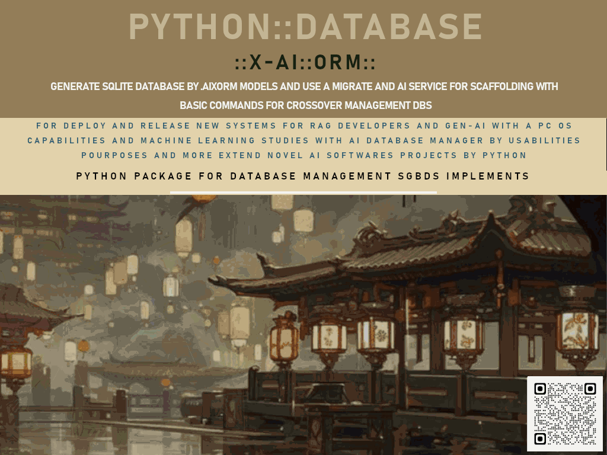

## 🧠 Python Database X-AI ORM
# PY_DBXIA_ORM  
### Python Database X-AI ORM  

[](https://github.com/ssmool/PY_DBXIA_ORM)  
[](https://pypi.org/project/database-xaiorm/)  



**Version:** 2.0 Beta  
**Status:** Under Development  
**Author:** #asytrick  
**Website:** [github.com/PY_DBXIA_ORM](https://github.com/ssmool/PY_DBXIA_ORM)  
**Contact:** eusmool@gmail.com  

---

````markdown
# PY_DBXIA_ORM  
*A Python Library for Database X-AI ORM*  

📌 Repository: [PY_DBXIA_ORM](https://github.com/ssmool/PY_DBXIA_ORM)  

---

## 📖 About  

**PY_DBXIA_ORM** is a Python package designed to provide an **Object-Relational Mapping (ORM)** and **Data Migration Toolkit** with extended features for **AI prompts**, **analytics**, **cryptography**, **HTML visualization**, and **GUI management**.  

It supports creating and managing SQLite databases, migrating data from **CSV, ODBC, MySQL, PostgreSQL**, and provides tools for **data visualization**, **binary BLOB storage**, **cryptography**, and more.  

---

## 📂 Library Structure  

The library is modular, organized into the following components:  

- **ORM** – Core Database Operations  
- **MIGRATE** – Data migration from CSV, ODBC, and RDBMS  
- **AI PROMPT** – Database model generation from natural language prompts  
- **ANALYTICS** – SQL data visualization with Pandas and plots  
- **BLOB DATA** – Binary and base64 data handling  
- **CRYPTOGRAPHY** – Fernet key generation, encryption & decryption  
- **HTML VIEW** – Generate HTML-based logs and data views  
- **GUI SUPPORT** – GTK window launcher for database management  
- **MACHINE LEARNING** – (Coming soon)  

---

## ⚙️ Installation  

The project is avaliable on the **PyPI**:  

```bash
#pip install database_xaiorm==8.0 #comming soon with a review for deploy
```


---

## 🗄 ORM – Database Operations

```python
from py_dbxia_orm import ORM

ORM.py_db_create("example.db")                     # Create new database
ORM.py_db_open("example.db")                       # Open database
ORM.py_table("users", "users_model", action="create")  # Create table with model
ORM.py_select("users", "age > 21")                 # Select with filter
ORM.py_update("users", "name='Alice'", "id=1")     # Update values with filter
ORM.py_delete("users", "id=2")                     # Delete with filter
ORM.py_write_log("User added", "INSERT", "users")  # Log an action
ORM.py_db_close()                                  # Close database
```

---

## 🔄 MIGRATE – Data Migration

### CSV

```python
from py_dbxia_orm import MIGRATE

MIGRATE.view_table_csv_uri("http://example.com/file.csv")
MIGRATE.view_table_csv_path("local_file.csv")
MIGRATE.save_table_csv_path("out.csv", "users")
MIGRATE.save_table_csv_to_database("example.db", "data.csv", "users")
```

### ODBC

```python
MIGRATE.orm_import_odbc("example.db", conn_odbc)
MIGRATE.orm_viewer_odbc(conn_odbc)
MIGRATE.orm_viewer_odbc_conn_close()
```

### RDBMS

```python
MIGRATE.orm_import_mysql("example.db", host, user, password, database, port)
MIGRATE.orm_import_postegre("example.db", host, user, password, database)
```

---

## 🤖 AI PROMPT – Table Creation via Prompt

```python
from py_dbxia_orm import AI

AI.py_db_create_prompt("example.db", "table for employees with name, role, and hire_date")
```

---

## 📊 ANALYTICS – Data Visualization

```python
from py_dbxia_orm import ANALYTICS

ANALYTICS.view_table("example.db", "users", "age > 20", "name", "age", _type="bar")
ANALYTICS.view_table_with_query("example.db", "users", "age > 30", "department", "salary")
```

---

## 📦 BLOB DATA – Binary Data Management

```python
from py_dbxia_orm import BLOB

encoded = BLOB.set_data_blob(b"binary content")
decoded = BLOB.get_data_from_blob(encoded)
```

---

## 🔐 CRYPTOGRAPHY – Secure Content

```python
from py_dbxia_orm import CRYPTO

key = CRYPTO.GenerateCriptoKey()
cipher = CRYPTO.CriptographyContent("secret data", key)
plain = CRYPTO.Uncripto(cipher, key)
```

---

## 🌐 HTML VIEW – Logs and Tables

```python
from py_dbxia_orm import HTML

HTML.view_log_html("example.db", _table="users", _html_path="log_output.html")
```

---

## 🖥 GUI SUPPORT

```python
from py_dbxia_orm import GUI

app = GUI.DatabaseApp()
app.show_all()
```

---

## 📑 DICT – Model Directory Example

Save a file: **people.pyiaorm**

```sql
name TEXT NOT NULL,
email TEXT NOT NULL UNIQUE,
created_at TIMESTAMP DEFAULT CURRENT_TIMESTAMP
```

Usage:

```python
ORM.py_table("tab_people", "people.pyiaorm", action="create")
ORM.py_create_model_table("_employee", "work TEXT NOT NULL, employee TEXT NOT NULL, created_at TIMESTAMP DEFAULT CURRENT_TIMESTAMP")
```

---

## 🧪 Machine Learning

🚧 *Coming soon – under construction...*

---

## 📌 Roadmap

* [x] ORM Base Functions
* [x] Migration from CSV, ODBC, MySQL, PostgreSQL
* [x] Analytics visualization
* [x] Blob Data & Cryptography
* [x] HTML & GUI Support
* [ ] Machine Learning Integration

---

##📫 Contact

💻 Autor: #asytrick
📧 Contact: eusmool@gmail.com
- Repository: [github.com/PY_DBXIA_ORM](https://github.com/ssmool/PY_DBXIA_ORM)  


